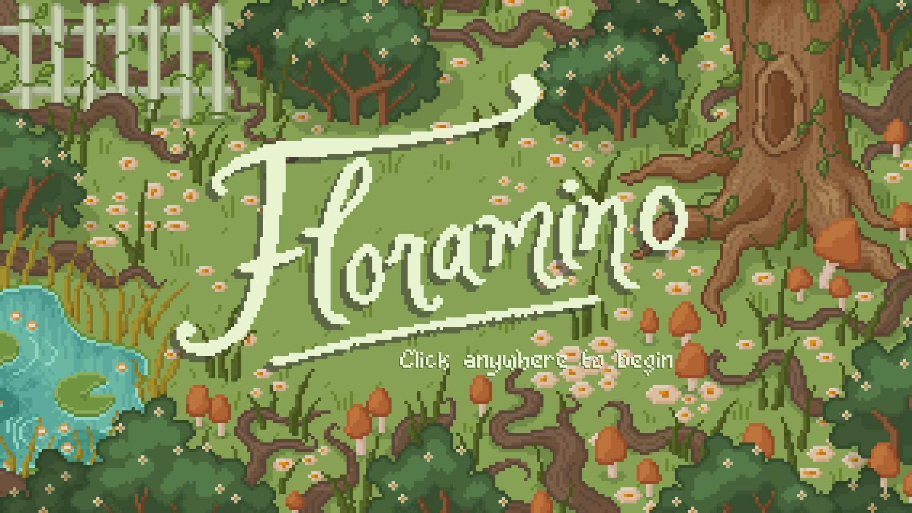
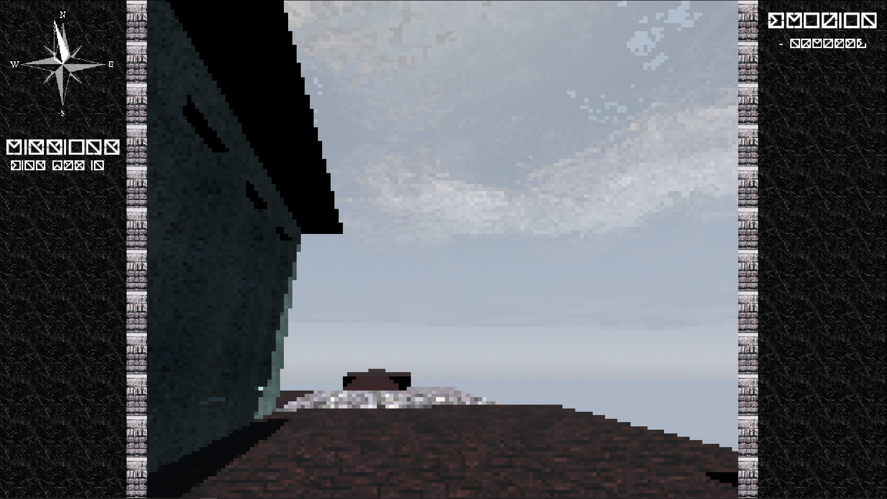
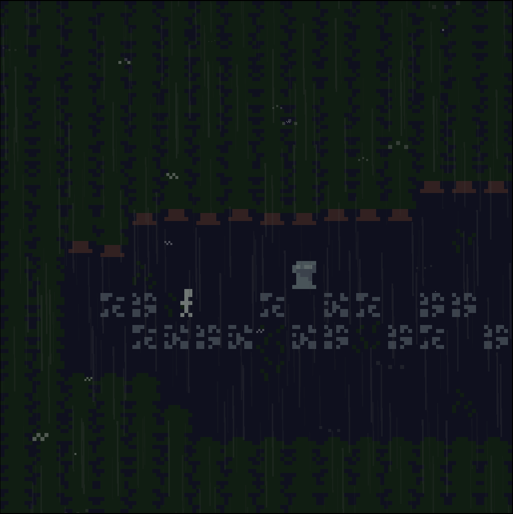
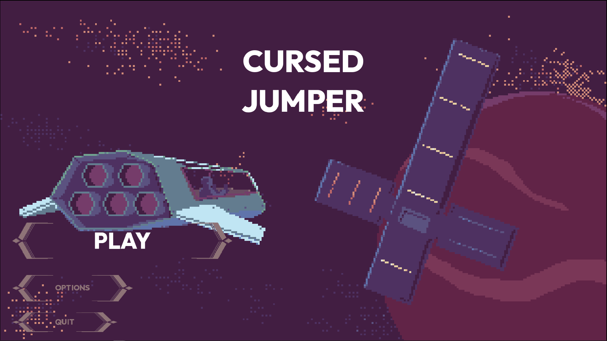
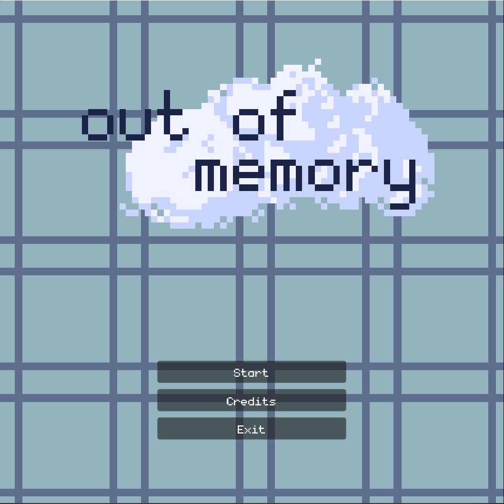

welcome back

.

<figure class="mission-board">
<pre>
╭─────────────╮    ╭──────────────────────╮
│    loved    ├────┤ - today's forecast - │
│  as always  ├────┤       downpour       │
╰─────────────╯    ╰──────────────────────╯

╭───────────────────────────╮
│                           │
│     today's missions:     │
│      - await <a href="https://bsky.app/profile/aoiazure.moe">contact</a>      │
│      - check <a href="https://aoiazure.itch.io/">itch.io</a>      │
│                           │
╰───────────────────────────╯

</pre>
</figure>

remember to rest.

## Mission Logs

Below, you may view previously completed missions and work completed by this operator.

Prior Work

<table class="prior-works">
  <tr>
    <th></th>
    <td>
      

        __game jam entry (48 hrs)__
        
        an arcade-y game about managing a garden in the shortness of spring.

        responsible for parts of the programming, game design.

        play it for free [here](https://luxille.itch.io/floramino).
      

    </td>
  </tr>
  <tr>
    <th></th>
    <td>
      

        __game jam entry (2 weeks)__
        
        a hyper-dense atmospheric game about leaving, even when you're happy.

        responsible for all art and writing.

        play it for free [here](https://aoiazure.itch.io/everyone-walked-away).
      

    </td>
  </tr>
  <tr>
    <th></th>
    <td>
      

        __personal project__

        a hyper-dense shortform atmospheric narrative game exploring grief and loss.

        responsible for all art, music, and writing.

        play it for free [here](https://aoiazure.itch.io/you-who-won-against-the-sun).
      

    </td>
  </tr>
  <tr>
    <th></th>
    <td>
      

        __game jam entry (2 weeks)__

        an action platformer where the player manages various curses that subvert and affect mobility options.

        responsible for programming, game design, UX/UI, QA.

        play it for free [here](https://aoiazure.itch.io/cursed-jumper).
      

    </td>
  </tr>
  <tr>
    <th></th>
    <td>
      

        __ludum dare 54 entry__

        a micro narrative game about choosing which of your life's memories you would rather keep when your brain has run out of room.

        responsible for all aspects.

        play it for free [here](https://aoiazure.itch.io/out-of-memory).
      

    </td>
  </tr>
</table>

